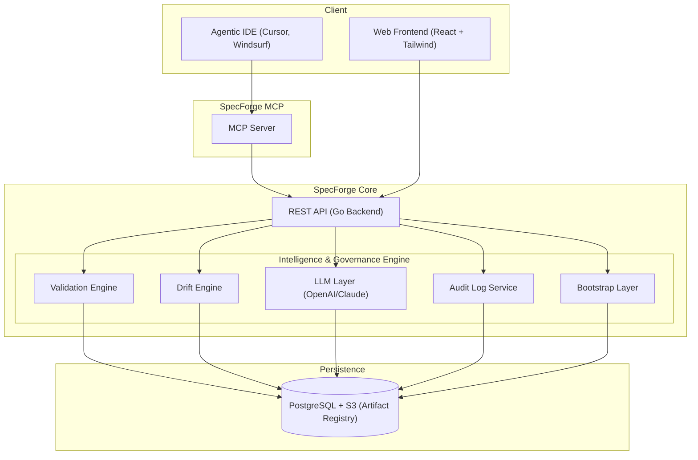

<p align="center">
  
</p>

# SpecForge
## Alpha Development Phase
### From Vision to Verifiable Execution


SpecForge is a structured AI governance and specification platform designed to bring order to the chaotic intersection of strategic vision and AI-assisted execution. By enforcing rigid contracts, schema validation, and full-lifecycle traceability, SpecForge ensures that LLM-generated artifacts align perfectly with business requirements and technical constraints. It bridges the gap between high-level strategy and verifiable implementation, providing a governed environment for responsible AI integration.

---

## 2 Why SpecForge Exists

In the era of AI-driven development, engineering teams face significant challenges:
*   **Artifact Inconsistency**: LLMs frequently generate artifacts that vary in style, structure, and quality, leading to technical debt.
*   **Specification Drift**: As implementations evolve, they often drift away from original specifications without detection.
*   **Unenforceable Roadmaps**: High-level roadmaps often lack the technical "teeth" to enforce contracts during execution.
*   **Reactive Governance**: Compliance and validation are often treated as afterthoughts rather than being embedded in the development workflow.

**SpecForge solves these problems by providing:**
*   **Structured Spec Modeling**: Moving from loose natural language to formal, schema-backed specifications.
*   **Roadmap-Driven Contracts**: Automatically generating enforceable technical contracts directly from strategic roadmap units.
*   **Governed LLM Augmentation**: Allowing LLMs to assist in creation while keeping them under strict schema and policy constraints.
*   **Full Traceability**: Maintaining an immutable audit log and lineage for every variable, contract, and spec.

---

## 3 Core Concepts

### Projects
A Project is the primary lifecycle container in SpecForge. It encapsulates all roadmap items, technical contracts, validation rules, and artifacts for a specific business initiative. Projects define the governance boundary and tech stack context.

### Roadmap Items
Strategic execution units that define the "What" and the "How". Each roadmap item includes:
*   **Goals & Business Context**: Clear definitions of success.
*   **Deliverables**: Specific technical artifacts required.
*   **Contracts**: Technical interface definitions.
*   **Validation Logic**: Rules that must pass before the item is considered complete.
*   **LLM Bootstrap**: Users may optionally invoke an LLM to auto-populate roadmap fields, validation schemas, and contracts. These proposals are subjected to SpecForge’s governance engine and human review before acceptance.

### Contracts
Formal, enforceable definitions of system interfaces including REST APIs, GraphQL schemas, CLI commands, and internal function signatures. Contracts define:
*   **Input/Output Schemas**: Rigorous JSON schema enforcement.
*   **Constraints**: Range, regex, and relational constraints.
*   **Error Handling**: Standardized failure modes and messages.

### Validation Engine
The heart of SpecForge governance. It performs:
*   **JSON Schema Enforcement**: Ensuring all artifacts match their defined models.
*   **Intelligence Alignment**: Detecting conflicts between related contracts or roadmap items.
*   **Dependency Graph Validation**: Checking that all referenced variables and contracts resolve correctly.
*   **Cross-Artifact Consistency**: Detecting drift between different versions or related specifications.

### Agent-Native Specification
SpecForge moves beyond human-readable docs toward **deterministic build artifacts**. Roadmap items can be exported as self-contained packages that include all context, contracts, and validation rules required for an autonomous coding agent to implement the feature with zero ambiguity.

### LLM Integration (Governed & Evaluated)
SpecForge treats LLMs as powerful assistants, not authoritative sources. All LLM-generated output is schema-checked before persistence. Furthermore, the **AI Self-Evaluation** engine scores the quality, ambiguity, and security of AI-proposed specs before they are presented for human review.

---

## 4 Feature Overview

| Feature | Description |
| :--- | :--- |
| **Structured Modeling** | Define features and requirements using domain-driven schemas. |
| **Project Bootstrap** | Automated ingestion of existing codebases to generate structured intelligence. |
| **Build Artifact Export** | Generate deterministic, agent-ready implementation packages (.specforge-build). |
| **Intelligence Alignment** | Detect logical misalignments and schema conflicts across the entire project. |
| **Schema Enforcement** | Real-time validation of all technical contracts and variables. |
| **Contract Builder** | Visual and code-based editors for REST, Event, and CLI contracts. |
| **Drift Tracking** | Automated detection of breaking changes and spec-to-code gap. |
| **Audit Logs** | Immutable history of all governance decisions and artifact mutations. |
| **UI Roadmap Engine** | Visual, deterministic UI specification with state machines and component trees. |
| **Intelligence Scoring** | Real-time metrics on spec completeness, readiness, and AI trust. |
| **MCP Server Integration** | Deep integration with Model Context Protocol for Agentic IDEs (Cursor, Windsurf) and Gen-AI assistants. |

---

## 5 Build Artifact Export Engine
SpecForge allows any Roadmap Item to generate a fully self-contained, agent-ready implementation package. These artifacts eliminate the ambiguity between a specification and its execution.

*   **Deterministic Bundles**: Exports include all contextual info, contracts, variables, and governance constraints in a structured `.specforge-build` format.
*   **AI Implementation Prompts**: Automatically generates hyper-specific prompts for coding agents (Cursor, Anti-Gravity), enforcing zero-assumption development.
*   **Refinement Loops**: Includes verification instructions and test generation requirements to guide agents through iterative self-correction.

## 6 Project Bootstrap Intelligence
The Bootstrap Layer allows teams to quickly onboard existing projects by ingesting their current state and generating a formal SpecForge foundation.

*   **Codebase Ingestion**: Automatically scans repositories to map modules, APIs, and data models.
*   **Structured Intelligence Snapshots**: Generates architecture scores, contract density metrics, and risk assessments based on existing code.
*   **Vision-to-Verifiable Execution**: Bridges the gap for legacy projects, bringing them under the strict governance of SpecForge contracts.

## 7 Intelligence Alignment & Cross-Feature Analysis
Modern systems are complex webs of dependencies. SpecForge ensures that no logic change in one module silently breaks another.

*   **Collision Detection**: Detects when two contracts define conflicting schemas for the same entity.
*   **Alignment Scoring**: A real-time metric indicating how well specifications across the project harmonize with each other.
*   **Self-Evaluating AI**: All AI suggestions are scored for ambiguity and security before human review, ensuring the highest "Trust Score" for new specifications.

## 8 UI Feature Roadmap Engine (UI-FRE)
SpecForge introduces the official **UI-FRE**, a deterministic specification engine for user interfaces. It eliminates the "handover gap" by modeling UI features as formal technical contracts.

*   **Deterministic Component Trees**: Model UI hierarchies as strictly-typed component nodes.
*   **State Machine Diagramming**: Define interactive flows (idle, loading, error, success) with visual and interaction mutations.
*   **Implementation Scoring**: Real-time "Readiness Score" based on contract compliance, accessibility audits (A11y), and backend binding accuracy.
*   **Multi-Artifact Export**: Generate implementation stubs for React/TS, Figma AI "Make" prompts, and Storybook stories directly from the spec.

---

## 8 System Architecture

SpecForge is built with a modern, high-performance stack designed for reliability and low-latency validation.



*   **Frontend**: React-based SPA with high-interactive visualization panels for dependency graphs and intelligence dashboards.
*   **Backend API**: Go-based services with a high-performance **Intelligence Engine** for real-time validation, alignment, and scoring.
*   **Bootstrap Layer**: Specialized ingestion engine for codebase analysis and snapshot generation.
*   **Validation & Alignment**: AUTHORITATIVE logic engine for JSON schema enforcement and cross-artifact consistency.
*   **Artifact Registry**: Versioned, immutable storage of all specifications, build artifacts, and snapshots.

---

## 9 LLM-Powered Roadmap Item Creation

### The Workflow
1.  **Initialize**: User creates a new Roadmap Item (e.g., "Add User Authentication").
2.  **Trigger AI**: User enables **"Populate with LLM"**.
3.  **Context Assembly**: SpecForge gathers project context, existing variable registries, and tech stack constraints.
4.  **Generation**: LLM returns a structured JSON proposal containing description, requirements, and contract stubs.
5.  **Validation**: The system runs the proposal through the Validation Engine (Schema check, Dependency check).
6.  **Human-in-the-loop**: User reviews the diff, edits where necessary, and approves.
7.  **Persistence**: The validated artifact is committed to the registry with full lineage.

### Example Proposal (Simplified)
```json
{
  "roadmap_item": {
    "title": "API Gateway Rate Limiting",
    "type": "FEATURE",
    "priority": "HIGH",
    "validation_rules": [
      { "name": "MaxRequestLimit", "type": "RANGE", "config": { "max": 1000 } }
    ]
  },
  "proposed_contracts": [
    {
      "type": "REST",
      "path": "/api/v1/limits",
      "method": "GET",
      "output_schema": { "type": "object", "properties": { "remaining": { "type": "integer" } } }
    }
  ]
}
```

---

## 10 UI Walkthrough

### Step 1: Create a Project
Navigate to the **Workspaces** dashboard and select "New Project". Define your tech stack and repository settings. Governance policies (strictness levels) are defined at this stage.

### Step 2: Add Roadmap Item
Inside the **Project View**, click "Add Roadmap Item". You can choose to manually enter details or use the **AI Bootstrap** feature to generate a complete draft from a simple prompt.

### Step 3: Define Contracts
Use the **Contract Editor** to define your technical interfaces. Every field is typed and backed by the **Variable Registry**, ensuring consistency across the entire project.

### Step 4: Attach Validation Rules
Define the "Rules of Engagement" in the **Validation Rules Panel**. Rules can range from simple schema checks to complex cross-field dependencies.

### Step 5: Review Dependency Graph
Visualize how your contracts and items relate. The graph highlights missing dependencies or mismatched schemas in real-time.

### Step 6: Execute & Track
*   **Dashboard**: High-level health and "Intelligence Score" across all features.
*   **Roadmap Panel**: Timeline view of execution units.
*   **Audit Logs**: View exactly who changed what, and why.

---

## 11 Governance & Enterprise Use Cases

SpecForge is engineered for high-compliance and mission-critical environments.

*   **Regulated Environments**: Direct mapping of specifications to regulatory controls (SOC2, HIPAA, GDPR).
*   **AI Governance**: Transparent and auditable use of LLMs in the SDLC.
*   **Security Specification**: Modeling security controls as first-class, verifiable contracts.
*   **ColdWater Security Integration**: SpecForge is the preferred platform for enterprise security teams, such as those at **ColdWater Security**, to model and enforce defensive architectures.

---

## 12 Installation & Development Setup

### Prerequisites
*   Go 1.25+
*   Node.js 24+
*   PostgreSQL 16+
*   Docker & Docker Compose (for containerized setup)
*   OpenAI / Anthropic API Key (for Intelligence features)

### Option 1: Docker (Recommended)
You can run the entire SpecForge stack (Frontend, Backend, and Database) using Docker Compose.

```bash
cp backend/.env.example backend/.env
# Update .env with your OpenAI/Anthropic API keys if needed
docker-compose up --build
```
This will automatically:
* Start a PostgreSQL 16 database.
* Run all database migrations.
* Start the Go Backend on `http://localhost:8080`.
* Start the React Frontend on `http://localhost:5173`.

### Option 2: Local Setup

#### Backend Setup
```bash
cd backend
cp .env.example .env
# Ensure PostgreSQL is running and update DATABASE_URL in .env if necessary
go mod download
go run cmd/api/main.go
```

#### Frontend Setup
```bash
cd frontend
npm install
npm run dev
```

---

## 13 Contributing Guidelines
We welcome contributions that align with our **Validation-First** philosophy.
1.  **Schema First**: Any new feature must start with a domain model update.
2.  **Tests Required**: All logic changes, especially in the Validation or Drift engines, require 100% test coverage.
3.  **Documentation**: README and OpenAPI specs must be updated alongside code.

---

## 14 Security Considerations
*   **Hallucination Mitigation**: All LLM outputs are treated as untrusted until validated by the schema engine and human review.
*   **Immutable Audit Logs**: All state changes are recorded in an append-only log.
*   **Contract Immutability**: Once a contract is used in production (approved), it must follow strict versioning and deprecation policies.

---

## 15 Roadmap
*   **[COMPLETED] Build Artifact Export Engine**: Agent-native deterministic exports.
*   **[COMPLETED] Project Bootstrap Intelligence**: Codebase ingestion and auto-spec generation.
*   **[COMPLETED] Intelligence Alignment Engine**: Cross-feature conflict detection.
*   **[COMPLETED] UI Feature Roadmap Engine**: Deterministic UI spec modeling and scoring.
*   **[COMPLETED] MCP Server Integration**: Full support for Model Context Protocol allowing Gen-AI IDE integration.
*   **Figma Live Sync**: Bi-directional synchronization between design and technical artifacts.
*   **Interactive State Simulation**: Visual playback of state machine transitions in the dashboard.
*   **Spec Diff Visualizer**: Advanced visual comparison for complex JSON schemas.
*   **Automated Compliance Mapping**: Automatically tagging specs with compliance controls (SOC2, etc.).
*   **Policy-as-Code Integration**: Enforcing organizational rules via OPA/Rego.

---
© 2026 SpecForge Platform. All Rights Reserved.
