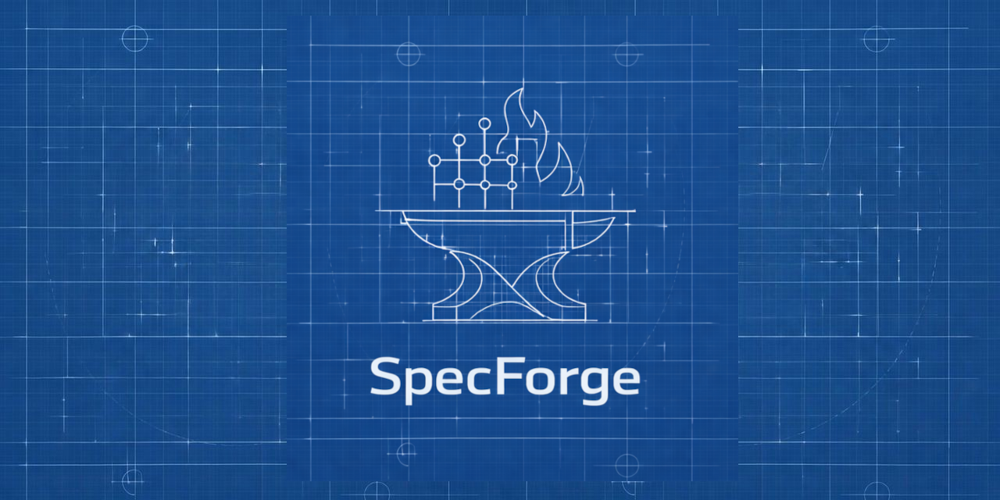

<p align="center">
  
</p>

<h1 align="center">SpecForge</h1>
<p align="center">
  <strong>Spec-Driven Roadmaps for AI-Native Development</strong><br/>
  Deterministic planning, governed execution, and contract-aware delivery.
</p>

<p align="center">
  <a href="https://github.com/SpecForgeVC/SpecForge">GitHub</a> •
  <a href="#why-specforge">Why</a> •
  <a href="#core-concepts">Concepts</a> •
  <a href="#architecture">Architecture</a> •
  <a href="#getting-started">Getting Started</a> •
  <a href="#roadmap">Roadmap</a>
</p>

---

## 🚀 What Is SpecForge?

**SpecForge** is a spec-driven roadmap and governance platform designed for AI-assisted development.

It ensures that:
- Features are defined before implementation
- Contracts cannot silently drift
- Variables remain controlled
- AI agents operate inside deterministic boundaries
- Projects remain catalogued, auditable, and reproducible

SpecForge transforms AI coding from *best-effort suggestion* into **governed execution aligned to declared specifications**.

---

## 🧠 Why SpecForge?

AI coding tools accelerate development — but introduce new risks:

- Contract drift
- Undocumented mutations
- Hallucinated changes
- Spec mismatch
- Untracked feature creep
- Non-deterministic agent behavior

SpecForge solves this by placing **specifications at the center of the development lifecycle**.

Instead of:
> "Let the agent modify the code and hope it aligns."

You get:
> "Define the spec. Enforce the contract. Govern the execution."

---

## 🏗 Core Concepts

### 📜 Contracts
Structured definitions of APIs, schemas, services, and boundaries.

Contracts are versioned, validated, and protected against drift.

---

### 🧩 Features
Explicit feature declarations that define:

- What must exist
- What must not change
- Dependencies
- Implementation boundaries
- Acceptance conditions

No feature exists without specification.

---

### 🔐 Variables
Controlled project-level configuration values.

Variables allow:
- Environment awareness
- Controlled regeneration
- Deterministic agent behavior

---

### 🗂 Project Import & Cataloguing
When a project is initialized:

- Required local documents are generated
- Contracts, features, and variables are declared
- The IDE is instructed to document required items locally
- Submission validates completeness
- The system confirms whether additional items exist

SpecForge ensures the full project is catalogued before execution begins.

---

### 🔌 MCP Integration
SpecForge integrates through an MCP server that:

- Issues static regeneratable API tokens
- Validates submissions
- Enforces spec completeness
- Governs agent tool calls
- Prevents partial or inconsistent imports

This allows IDEs (Cursor, Claude, Antigravity, etc.) to operate within defined guardrails to prevent API drift on-scale.

---

## 🧱 Architecture Overview

SpecForge is built around:

- **Spec Registry**
- **Project Import Engine**
- **Contract Validation Layer**
- **MCP Governance Server**
- **Feature Intelligence Layer**

## 🌀 SpecForge Project Workflow
The end-to-end process for managing a project in SpecForge ensures that every feature, contract, and variable is fully specified, validated, and governed. The recommended workflow is:

1. **Initialize Project**  
   Start a new project in SpecForge to create its workspace and define the baseline environment.

2. **Decide on Project Context**  
   Define the project’s purpose, scope, architecture, and intended outcomes. This ensures the AI agents and contributors operate with full context.

3. **Plan a New Feature**  
   Specify the new feature’s requirements, dependencies, limits, and acceptance criteria before any implementation begins.

4. **Create Validated Contracts**  
   Define communication schemas, APIs, and interfaces using OpenAPI 3 or similar structured specifications. Contracts enforce boundaries and prevent drift.

5. **Export Build Artifacts**  
   Generate artifacts containing all necessary specifications, variables, contracts, and prompts. These artifacts can be consumed by the user’s preferred AI-assisted IDE or coding agent.

6. **IDE Generates Required Local Documentation & Snapshots**  
   The IDE scaffolds the necessary local files (contracts, variables, features, etc.) and captures snapshots of the project environment for auditing and validation.

7. **Submit Project Data and Snapshots to SpecForge Using MCP Server**  
   All local documents, snapshots, and artifacts are submitted through the MCP server, ensuring authenticated, structured, and versioned intake.

8. **Validate Contracts and Completeness**  
   SpecForge verifies that all contracts, features, and variables are correctly documented, complete, and consistent with the project context.

9. **Remediate Any Drift**  
   Identify discrepancies, incomplete documentation, or unintended changes, and provide feedback loops for correction before final locking.

10. **Confirm Additional Items**  
   The IDE performs self-assessment to ensure no features, variables, or contracts remain undocumented. Submit any additional items iteratively until completeness is confirmed.

11. **Lock and Govern Execution**  
   Once the project is fully catalogued, execution is locked. SpecForge enforces governance over AI-driven code modifications, ensuring deterministic, auditable, and spec-compliant development.

---

## ⚙️ Getting Started

### Clone the repository

```bash
git clone https://github.com/SpecForgeVC/SpecForge.git
cd SpecForge
# Install dependencies
npm install
# Run locally
npm run dev
```

## 🎯 Who Is This For?

SpecForge is ideal for:

- AI-native development teams  
- Startups using coding agents heavily  
- Founders seeking deterministic build pipelines  
- Teams enforcing strict API governance  
- Developers building multi-agent systems  
- Projects requiring reproducibility and auditability  

---

## 🔍 What Makes SpecForge Different?

| Traditional Roadmap Tools | SpecForge |
|---------------------------|-----------|
| Task-based tracking | Spec-driven governance |
| Manual enforcement | Automated validation |
| Agent suggestions | Agent boundaries |
| Docs separate from code | Spec embedded in workflow |
| Reactive fixes | Preventative enforcement |

SpecForge is not just planning software.

It is governance infrastructure for AI-driven engineering.

---

## 🛣 Roadmap

### Alpha

- Spec registry  
- Project import workflow  
- Contract enforcement  
- MCP integration  
- IDE onboarding support
- Drift detection engine
- UI development planning
- Self-Refining blueprint design process
- Build artifacts, schemas, plans and build prompt exports

### Beta

- Multi-project orchestration  
- Role-based governance  
- CI/CD enforcement hooks  
- More robust, detailed feature intelligence dashboard  

### Production

- Enterprise governance controls  
- Distributed spec validation  
- Immutable audit trails  
- Team management and access control  

---

## 🤝 Contributing

Contributions, discussions, and architectural feedback are welcome.

Please:

- Open an issue  
- Propose improvements  
- Submit a pull request  

SpecForge is evolving — and early architectural feedback is invaluable.

---

## 🧭 Vision

AI-assisted development should not mean chaos.

It should mean:

- Determinism  
- Governance  
- Auditability  
- Reproducibility  
- Specification-first engineering  

SpecForge exists to make that possible.

---

<p align="center">
  <strong>SpecForge</strong><br/>
  Bringing determinism to agentic development.
</p>
